# Collapse same-text idGd entries

## Problem

Effect parts (`idGd`) are indexed by numeric ID. Some parts share identical text but have different IDs, which inflates `idgd_catalog.json`, bitmap count, and the effects list API. We need a build/merge option to collapse these duplicates (enabled by default), while **preserving knowledge of duplicate IDs** on the canonical catalog entry so clients can still query with legacy/duplicate ids.

## Matching rule (confirmed)

Collapse two `idGd` values when **both** match:
- Same `element_type` (`TRIGGER`, `CONDITION`, or `OUTPUT`)
- Same effect text for locale `en_US` (using the same fallback chain as [`pick_translation`](index-core/src/query.rs): requested locale → `en_US` → first available)

Skip entries with empty text (do not collapse unknown/blank parts).

**Canonical ID:** lowest `id_gd` in each group (stable, deterministic).

## Architecture

```mermaid
flowchart TD
    subgraph build [build command]
        B1[Index all cards] --> B2{merge_duplicated_abilities?}
        B2 -->|yes| B3[Build remap from IdGdCatalogBuilder drafts]
        B3 --> B4[Remap bitmaps + compact_cards]
        B4 --> B5[Set duplicated_id_gd on canonical catalog entries]
        B2 -->|no| B6[write_index_outputs]
        B5 --> B6
    end
    subgraph merge [merge command]
        M1[write_cards_bin + merge_id_gd] --> M2{merge_duplicated_abilities?}
        M2 -->|yes| M3[Build remap from merged meta]
        M3 --> M4[OR-merge alias bitmaps into canonical on disk]
        M4 --> M5[Remap cards.bin id slots]
        M5 --> M6[Merge duplicated_id_gd on canonical catalog entries]
        M2 -->|no| M7[write_idgd_catalog]
        M6 --> M7
    end
    subgraph query [query time]
        Q1[Client sends idGd 200] --> Q2[Build alias map from idgd_catalog duplicated_id_gd]
        Q2 --> Q3[Resolve 200 to canonical 100]
        Q3 --> Q4[Bucket + bitmap lookup on canonical id]
    end
```



Core logic lives in a new shared module so build (in-memory), merge (on-disk), and query-time alias resolution reuse the same remap types.

## Catalog: `duplicated_id_gd` on canonical entries

Add an optional field to [`IdGdCatalogEntry`](index-core/src/idgd_catalog.rs). Omitted when empty (no collapse, or entry has no duplicates).

```json
{
  "set": "COREKS",
  "entries": [
    {
      "id_gd": 100,
      "card_count": 42,
      "bitmap_file": "100.roar",
      "element_type": "TRIGGER",
      "translations": { "en_US": { "locale": "en_US", "text": "When you play a card" } },
      "duplicated_id_gd": [200, 300],
      "is_main": true,
      "is_echo": false
    }
  ]
}
```

| Field | Meaning |
|-------|---------|
| `duplicated_id_gd` | Non-canonical ids collapsed into this entry. No separate catalog row or bitmap files for these ids. Sorted ascending for stable output. |

**Build:** after collapse remap, set `duplicated_id_gd` on each canonical `DraftEntry` / final catalog entry from the inverse of the remap.

**Merge:**
1. When combining source `idgd_catalog.json` files, carry forward `duplicated_id_gd` from source canonical entries (rewriting any id that was collapsed again at merge time).
2. After merge-time collapse, union `duplicated_id_gd` onto the new canonical entry (old canonical ids that became duplicates are included too).

No changes to `manifest.json`.

## Query-time alias resolution

Collapsed duplicate ids are **not** separate rows in `idgd_catalog.json` and have **no** `.roar` files. Queries must resolve aliases before catalog validation and bitmap lookup.

### Shared type (`idgd_collapse.rs`)

```rust
pub struct IdGdAliasMap {
    alias_to_canonical: BTreeMap<u32, u32>,
}

impl IdGdAliasMap {
    pub fn from_catalog(catalog: &IdGdCatalog) -> Self;
    pub fn resolve(&self, id: u32) -> u32; // identity if not an alias
    pub fn resolve_ids(&self, ids: &[u32]) -> Vec<u32>; // dedupe after resolve
}
```

Built by iterating catalog entries: for each entry with `duplicated_id_gd`, insert `dup → entry.id_gd` for every duplicate id.

### `cli-indexer query` ([`index-core/src/query.rs`](index-core/src/query.rs))

1. After loading `idgd_catalog.json`, build `IdGdAliasMap::from_catalog`.
2. In `bucket_id_gds`, resolve each requested id before catalog lookup and bucket insertion.

### HTTP API

| Location | Change |
|----------|--------|
| [`index-core/src/idgd_catalog.rs`](index-core/src/idgd_catalog.rs) | Add `#[serde(default, skip_serializing_if = "Vec::is_empty")] duplicated_id_gd: Vec<u32>` to `IdGdCatalogEntry` |
| [`uniques-http-api/src/index/uniques_index.rs`](uniques-http-api/src/index/uniques_index.rs) | Store `id_gd_aliases: IdGdAliasMap` built at load from catalog; add `resolve_id_gd(id) -> u32` |
| [`uniques-http-api/src/http/api/cards/parse.rs`](uniques-http-api/src/http/api/cards/parse.rs) | In `validate_idgd_types`, resolve each id before catalog type check |
| [`uniques-http-api/src/index/query/cards.rs`](uniques-http-api/src/index/query/cards.rs) | Resolve ids in bitmap helpers |
| [`uniques-http-api/src/http/api/effects/filtered.rs`](uniques-http-api/src/http/api/effects/filtered.rs) | Resolve ids in `union_on_line` |
| [`uniques-http-api/src/http/api/effects/list.rs`](uniques-http-api/src/http/api/effects/list.rs) | Pass through `duplicated_id_gd` on `EffectPartWithRegion` when non-empty |

**Effects list (`GET /api/v2/effects`):** lists canonical entries only; each entry may include `duplicatedIdGd` (camelCase in JSON) so clients know legacy ids.

**Effects filtered response:** continues returning canonical `id_gds` from the catalog.

## Files to change

| File | Change |
|------|--------|
| [`index-core/src/idgd_collapse.rs`](index-core/src/idgd_collapse.rs) | **New** — remap builder, alias map, apply helpers |
| [`index-core/src/lib.rs`](index-core/src/lib.rs) | `pub mod idgd_collapse` |
| [`index-core/src/card.rs`](index-core/src/card.rs) | Add `pub fn translation_text(...)` |
| [`index-core/src/bitmap.rs`](index-core/src/bitmap.rs) | Add `remap_ids` on `BitmapStore` and `PerLineBitmapStore` |
| [`index-core/src/compact.rs`](index-core/src/compact.rs) | Add `remap_id_gd_fields` |
| [`index-core/src/idgd_catalog.rs`](index-core/src/idgd_catalog.rs) | `duplicated_id_gd` on `IdGdCatalogEntry`; `apply_collapse_remap` sets field on canonical drafts |
| [`index-core/src/build.rs`](index-core/src/build.rs) | `BuildOptions { merge_duplicated_abilities }`, collapse pass |
| [`index-core/src/merge.rs`](index-core/src/merge.rs) | `MergeOptions { merge_duplicated_abilities }`, on-disk collapse, merge `duplicated_id_gd` when writing `idgd_catalog.json` |
| [`index-core/src/query.rs`](index-core/src/query.rs) | Build alias map from catalog; resolve in `bucket_id_gds` |
| [`cli-indexer/src/cli.rs`](cli-indexer/src/cli.rs) | `--merge-duplicated-abilities` (default `true`) on `Build` and `Merge` |
| [`uniques-http-api/src/index/loader.rs`](uniques-http-api/src/index/loader.rs) | Build `IdGdAliasMap` when assembling `UniquesIndex` |
| [`uniques-http-api/src/index/uniques_index.rs`](uniques-http-api/src/index/uniques_index.rs) | `id_gd_aliases` + `resolve_id_gd` |
| [`uniques-http-api/src/http/api/cards/parse.rs`](uniques-http-api/src/http/api/cards/parse.rs) | Resolve aliases in `validate_idgd_types` |
| [`uniques-http-api/src/index/query/cards.rs`](uniques-http-api/src/index/query/cards.rs) | Resolve aliases in bitmap helpers |
| [`uniques-http-api/src/http/api/effects/filtered.rs`](uniques-http-api/src/http/api/effects/filtered.rs) | Resolve aliases in `union_on_line` |
| [`uniques-http-api/src/http/api/effects/models.rs`](uniques-http-api/src/http/api/effects/models.rs) | Optional `duplicated_id_gd` on `EffectPartWithRegion` (serializes as `duplicatedIdGd`) |
| [`docs/cli-reference.md`](docs/cli-reference.md) | Document flag |
| [`docs/ALL_SETS-index-format.md`](docs/ALL_SETS-index-format.md) | Document `duplicated_id_gd` on `IdGdCatalogEntry` |
| [`cli-indexer/plans/13-collapse-same-text-idgd.md`](cli-indexer/plans/13-collapse-same-text-idgd.md) | Persist this plan |

## Implementation details

### 1. Shared collapse module (`idgd_collapse.rs`)

```rust
pub struct CollapseEntry {
    pub id_gd: u32,
    pub element_type: String,
    pub translations: BTreeMap<String, LocaleText>,
}

pub fn build_collapse_remap(entries: impl IntoIterator<Item = CollapseEntry>) -> BTreeMap<u32, u32>
pub fn duplicated_id_gd_from_remap(remap: &BTreeMap<u32, u32>) -> BTreeMap<u32, Vec<u32>>
```

- `build_collapse_remap`: group by `(element_type, en_US text)`; non-canonical → `min(id_gd)`
- `duplicated_id_gd_from_remap`: invert flat remap into `canonical → [duplicated_id_gd]` (sorted)

### 2. Build-time apply (in-memory, before write)

In [`build()`](index-core/src/build.rs) after the card loop:

1. If `!options.merge_duplicated_abilities`, skip
2. `let remap = build_collapse_remap(...)`
3. If non-empty: remap bitmaps, per-line bitmaps, `compact_cards`
4. `idgd_catalog_builder.apply_collapse_remap(&remap)` — drops alias draft entries; sets `duplicated_id_gd` on canonical drafts
5. `write_index_outputs` serializes catalog with `duplicated_id_gd` on affected entries

### 3. Merge-time apply (on-disk)

After `merge_id_gd` + `write_cards_bin`:

1. If enabled: collapse on disk; update `meta`/`sizes`
2. When building merged `idgd_catalog.json` in `write_idgd_catalog`:
   - Union `duplicated_id_gd` from source catalogs onto merged canonical entries
   - Apply merge-time `duplicated_id_gd_from_remap` on top

### 4. CLI flags

`--merge-duplicated-abilities` on `Build` and `Merge`, default `true`. Disable with `--merge-duplicated-abilities false`.

Internal options structs use `merge_duplicated_abilities: bool` (`BuildOptions`, `MergeOptions`).

### 5. Tests

- Remap grouping, `duplicated_id_gd_from_remap` inversion
- `IdGdCatalogEntry` serializes `duplicated_id_gd` only when non-empty
- `IdGdAliasMap::from_catalog` + resolve
- `bucket_id_gds` / HTTP validation accept duplicate id
- Effects list includes `duplicatedIdGd` when present

### 6. Non-goals

- No text normalization beyond exact string match
- No separate manifest or sidecar file for duplicate ids
- No runtime collapse without rebuild

## Expected outcome

- `idgd_catalog.json` canonical entries carry `duplicated_id_gd` documenting collapsed ids
- `id_gd_count` and bitmap file count shrink to canonical entries only
- `cli-indexer query --id-gd 200` works when 200 is listed in `duplicated_id_gd` of canonical 100
- HTTP `/api/v2/cards` and `/api/v2/effects/filtered` accept duplicate ids in filters
- `GET /api/v2/effects` exposes `duplicatedIdGd` on entries that have them
- Backward compatible: entries without `duplicated_id_gd` behave as today
