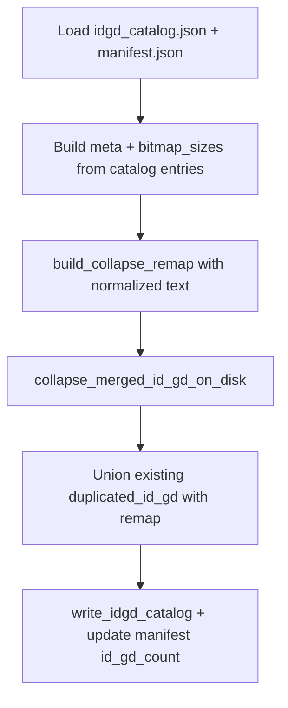

# Whitespace-normalized dedup + standalone `dedup-abilities`

## Goal

Only **95 / 214** (regular SPACE vs NBSP before `{2}`) is a valid duplicate among current candidates. Fix collapse detection by **normalizing whitespace before grouping**, and add **`cli-indexer dedup-abilities`** to run that pass on an existing index directory.

## Root cause

[`build_collapse_remap`](index-core/src/idgd_collapse.rs) groups by exact `(element_type, en_US text)`:

```57:68:index-core/src/idgd_collapse.rs
pub fn build_collapse_remap(entries: impl IntoIterator<Item = CollapseEntry>) -> BTreeMap<u32, u32> {
    let mut groups: BTreeMap<(String, String), Vec<u32>> = BTreeMap::new();
    for entry in entries {
        let text = translation_text(&entry.translations, COLLAPSE_LOCALE);
        // ...
        groups.entry((entry.element_type, text)).or_default().push(entry.id_gd);
```

95 uses U+0020; 214 uses U+00A0 — same visible text, different group key.

## 1. Whitespace normalization in `index-core`

**File:** [`index-core/src/idgd_collapse.rs`](index-core/src/idgd_collapse.rs)

Add a small helper (no new crate deps):

```rust
fn normalize_collapse_text(text: &str) -> String {
    // Map NBSP / narrow NBSP / figure space → ASCII space
    // Optionally collapse runs of whitespace to a single space (trim ends only if needed)
}
```

Change `build_collapse_remap` to group by `(element_type, normalize_collapse_text(&text))` instead of raw text.

**Canonical selection** (which entry survives in the catalog):

When a group has multiple members, pick canonical in this order:

1. **Prefer raw text with NBSP** (`U+00A0` in `en_US` text) — keeps the “marked” version on disk.
2. If several contain NBSP, use `min(id_gd)` among those.
3. If none contain NBSP, use `min(id_gd)` (unchanged default for exact-text duplicates).

Example **95 / 214**: normalized text matches → canonical **214** (NBSP), remap `{95: 214}`, `duplicated_id_gd: [95]` on entry 214.

```rust
fn text_has_nbsp(text: &str) -> bool {
    text.contains('\u{00a0}')
}

fn choose_canonical_id(ids: &[u32], text_by_id: &BTreeMap<u32, String>) -> u32 {
    let nbsp_ids: Vec<u32> = ids.iter().copied().filter(|id| text_has_nbsp(&text_by_id[id])).collect();
    if !nbsp_ids.is_empty() {
        return *nbsp_ids.iter().min().unwrap();
    }
    *ids.iter().min().unwrap()
}
```

- **Comparison** uses normalized text; **stored translations** on the canonical entry are the raw text from the chosen canonical id (NBSP preserved).
- Alias bitmaps merge into the canonical id’s bitmaps; alias catalog rows are dropped.

**Tests** (same file `#[cfg(test)]`):

- NBSP vs SPACE with identical visible text → remap `{95: 214}`; canonical text still contains `\u{00a0}`
- Exact-text duplicates (no NBSP) → still canonical `min(id_gd)`
- Unrelated texts still do not collapse
- Existing tests remain green

Because `apply_build_collapse` (build) and `collapse_merged_id_gd_on_disk` (merge) both call `build_collapse_remap`, **build** and **merge** pick up the fix automatically with no extra flags.

## 2. Standalone collapse on existing index

**New public API** in [`index-core/src/idgd_collapse.rs`](index-core/src/idgd_collapse.rs) (or thin wrapper module if it grows):

```rust
pub struct DedupAbilitiesSummary {
    pub index_dir: PathBuf,
    pub collapsed_pairs: usize,   // alias count
    pub id_gd_before: usize,
    pub id_gd_after: usize,
}

pub fn dedup_abilities_on_disk(index_dir: &Path) -> Result<DedupAbilitiesSummary>
```

**Algorithm** (reuses existing on-disk helpers):



Concrete steps:

1. Read `idgd_catalog.json` and `manifest.json` from `--index-dir` (same layout as [`add_extra_filter`](index-core/src/add_extra_filter.rs): folder containing `catalog.json`, `manifest.json`, `id_gd/`, `cards.bin`).
2. Build `meta` + `bitmap_sizes` maps from catalog entries (element_type, translations, region flags, `bitmap_bytes`).
3. Call existing `collapse_merged_id_gd_on_disk(index_dir, &mut meta, &mut sizes)` → `remap`.
4. Build final `duplicated_id_gd`:
   - Start from `duplicated_id_gd_from_remap(&remap)`
   - Union any pre-existing `duplicated_id_gd` on catalog entries, resolving through `remap` (same logic as [`build_merged_duplicated_id_gd`](index-core/src/idgd_collapse.rs) but single-catalog source).
5. Rewrite `idgd_catalog.json` — extract or share [`write_idgd_catalog`](index-core/src/merge.rs) logic (currently private in merge.rs) into a reusable helper in `idgd_collapse.rs` or `idgd_catalog.rs`.
6. Update `manifest.json` `id_gd_count` to post-collapse count.

If `remap` is empty, exit cleanly with a short summary (“0 new collapses”).

## 3. CLI subcommand

**File:** [`cli-indexer/src/cli.rs`](cli-indexer/src/cli.rs)

Add subcommand (user-chosen name):

```rust
/// Collapse idGd entries with identical effect text on an existing index.
DedupAbilities {
    /// Index directory (contains manifest.json, idgd_catalog.json, id_gd/, cards.bin)
    #[arg(long)]
    index_dir: PathBuf,
},
```

Wire to `index_core::idgd_collapse::dedup_abilities_on_disk` and print summary (pairs collapsed, id_gd before/after).

**Example:**

```bash
cargo run -p cli-indexer -- dedup-abilities \
  --index-dir ./build/full_index/ALL_SETS
```

## 4. Justfile recipe

**File:** [`justfile`](justfile)

Add a production-group recipe alongside `index-merge`, defaulting to the merged full index path used elsewhere (`query`, `create-index-all`):

```just
# Collapse duplicate idGd abilities on the merged full index.
[group('4-production')]
dedup-abilities index_dir="build/full_index/ALL_SETS":
    cargo run -p cli-indexer --release -- dedup-abilities --index-dir {{index_dir}}
```

**Usage:**

```bash
just dedup-abilities
just dedup-abilities index_dir=build/sets_index/COREKS   # optional override
```

## 5. Docs and plan

- Update [`docs/cli-reference.md`](docs/cli-reference.md) with `dedup-abilities` section.
- Note in [`docs/ALL_SETS-index-format.md`](docs/ALL_SETS-index-format.md) that collapse compares **whitespace-normalized** `en_US` text, and when duplicates differ only by whitespace the canonical entry **prefers the NBSP-bearing raw text**.
- Write plan to [`cli-indexer/plans/14-dedup-whitespace-normalize.md`](cli-indexer/plans/14-dedup-whitespace-normalize.md).

## 6. Verification

- Unit test: 95/214 texts collapse after normalization; canonical is **214** with NBSP preserved.
- Manual: run `just dedup-abilities` on current `ALL_SETS`; confirm **95** merges into **214** (`duplicated_id_gd` on 214 contains 95).
- `cargo test -p index-core` and `cargo test -p cli-indexer`.

## Out of scope

- Functional duplicates (Base/Hand, do/don't, number words) — still excluded by design.
- Rewriting source translation strings to normalized whitespace in the catalog.
