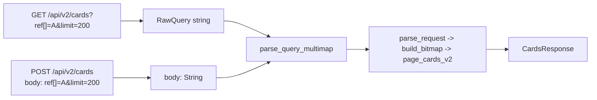

## Plan 25: `POST /api/v2/cards`

### Goal

Let a client send a large `ref[]`/`collectorNumber[]` (or any other filter combination) without
hitting the GET query-string size ceiling (~8 KB, already flagged as a future risk in
[`docs/non-unique-refonte-decisions.md` D7](../../docs/non-unique-refonte-decisions.md)), **without**
introducing a second endpoint/response contract to maintain.

`POST /api/v2/cards` accepts the exact same parameter names as `GET /api/v2/cards`, carried in the
request body instead of the URL, and returns the identical `CardsResponse` shape. No new semantics.

### Design

Body encoding is `application/x-www-form-urlencoded` — the same bytes that would otherwise follow
`?` in the URL (e.g. `ref[]=A&ref[]=B&limit=200`). This makes it a zero-duplication addition: the
existing `parse_query_multimap(query: Option<&str>)` in `parse.rs` already parses exactly this
format; call it on the POST body string instead of `RawQuery`'s string, then reuse every downstream
step unchanged (`parse_request`, `build_bitmap`, paging, `CardsResponse` construction).

### Implementation

- `http/api/cards/handlers.rs`: extract the shared tail of `get_cards_v2` (everything after
  `parse_query_multimap`) into `async fn respond_cards(server: &ServerState, params: &QueryMultiMap) -> ApiResult<Json<CardsResponse>>`.
  - `get_cards_v2` parses `RawQuery`, calls `respond_cards`.
  - New `post_cards_v2(State(server), body: String) -> ApiResult<Json<CardsResponse>>` calls
    `parse_query_multimap(Some(&body))`, then `respond_cards`.
- `http/api/cards.rs` (`router()`): `.route("/api/v2/cards", get(handlers::get_cards_v2).post(handlers::post_cards_v2))` — same path, added verb. Apply `DefaultBodyLimit` the same way
  `collections::router()` does (see below).
- `config.rs`: new `CardsSettings { max_post_payload_bytes: u64 }`, mirroring
  `CollectionsSettings.max_post_payload_bytes` field-for-field (`0` = Axum's 2 MiB default), added to
  `Settings` and validated alongside `validate_collections`.
- `http/api.rs` (`router()`) and its one caller in `http.rs`: thread `&settings.cards` through
  alongside `&settings.collections`.

### API semantics (unchanged from GET, just relocated)

| Aspect | Behavior |
| --- | --- |
| Param names | Identical to `GET /api/v2/cards` (`ref[]`, `collectorNumber[]`, `q`, `faction[]`, `set[]`, cost filters, `limit`, `page`, `cursor`, `withFamilies`, `format`, `collection`) |
| Body encoding | `application/x-www-form-urlencoded`, same shape as a query string |
| Response | Identical `CardsResponse` (`{ iter, cards, families? }`) |
| Errors | Identical (`400`/`422` from `parse_request`/`build_bitmap`, unchanged) |
| Size limit | `cards.max_post_payload_bytes` config (`0` = Axum default 2 MiB) |
| Item-count limit | None beyond the body-size limit (matches D7's existing GET stance) |

### Verification

- Unit: `post_cards_v2` with a form-urlencoded body produces a byte-identical `CardsResponse` to
  the equivalent `GET` call, for a handful of param combinations (ref-only, faction+cost, `q`).
- Integration: a body exceeding `max_post_payload_bytes` is rejected (`413`, Axum's own behavior via
  `DefaultBodyLimit`) when configured; unconfigured (`0`) falls back to Axum's 2 MiB default.
- `docs/api-spec.md`: document `POST /api/v2/cards` right under the `GET` section, cross-referencing
  it as "same parameters, body instead of query string" rather than duplicating every param row.

### Out of scope

- Any new response shape or order/null-preservation semantics — this is deliberately **not** a
  bespoke batch contract (an earlier draft of this plan proposed one; dropped in favor of reusing
  the existing GET contract to avoid double maintenance).
- A new endpoint path — this is the same `/api/v2/cards` URL, just a second verb.
