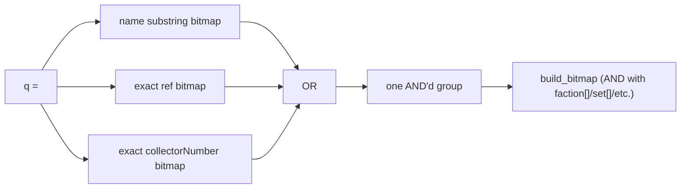

## Plan 26: Collector number filter + unified search parameter (`q`)

### Goal

1. A standalone `collectorNumber[]`/`collectorNumber=` filter on `/api/v2/cards`, exact match,
   same lenient/AND semantics as `ref[]`.
2. A single `q` parameter for the demo-ui's one search box: OR across name substring match, exact
   reference match, and exact collector-number match — because `name`/`ref[]`/`collectorNumber[]`
   are independent filters that **AND** together by design (see `api-spec.md`), wiring one input to
   all three today would zero out results whenever a term can't satisfy all three at once.

Depends on `cli-indexer/plans/24-collector-number-ingestion.md` (adds `collector_family_number` to
`FamilyMetadata`/`FamilyEntry`).

### Collector number lookup (mirrors `FamilyLookupIndex` / plan 10)

- `index/loader.rs`: `CollectorNumberLookupIndex` — `HashMap<(String set, String family_collector_number), FamilySpan>` (reuses the existing `FamilySpan { start_bit, max_unique_id }`), built by
  `build_collector_number_lookup_index(catalog)` alongside `build_family_lookup_index`. Stored on
  `UniquesIndex` the same way.
- `index/uniques_index.rs`: `resolve_card_index_by_collector_number(&self, s: &str) -> Result<u32, CardResolveError>` — parse `s` as `{SET}-{FAM}-U-{UID}` (4 segments, third must be
  literally `U`; anything else → `BadRequest`), look up `(SET, FAM)`, bounds-check
  `UID <= max_unique_id` → `card_index = start_bit + UID - 1` (mirrors `resolve_card_index`'s
  reference-parsing path).

### Standalone `collectorNumber[]` filter

- `http/api/cards/models.rs`: `collector_number: Vec<String>` on `CardsRequest`; `collector_number: Option<String>` on `CardV2` (`#[serde(rename_all = "camelCase")]` already on the struct → JSON key
  `collectorNumber`, `skip_serializing_if = "Option::is_none"`).
- `http/api/cards/parse.rs`: `parse_collector_numbers` mirrors `parse_refs` exactly —
  `collectorNumber[]` repeated keys + `collectorNumber=` CSV alias, dedup, trim, ignore blanks.
- `index/query/cards.rs`:
  - `build_bitmap`: new group, mirroring the existing `refs` group — resolve each requested value
    via `resolve_card_index_by_collector_number` (lenient: unresolved values just don't set a bit),
    OR them into one bitmap, push as one AND'd group.
  - `card_v2_from_index`: compute the response field —
    `format!("{}-{}-U-{}", set.code?, family.collector_family_number?, unique_id)`; `None` if either
    piece is missing (e.g. an index built before this plan, or a family from the deferred
    `cardsdata.rs` path).

### Unified `q` parameter

- `CardsRequest.q: Option<String>`; `parse.rs::parse_q` — trim, empty/whitespace → `None` (same rule
  as `parse_name`). Independent of `name`/`ref[]`/`collectorNumber[]`, which keep their current AND
  semantics unchanged.
- `build_bitmap`, when `q` is set — one OR'd group:
  1. `state.name_search_index().bitmap_for_contains(catalog, q)` (existing substring/accent-insensitive
     match)
  2. `index_core::build_bitmap_from_ref_strs_lenient(catalog, &[q])` (existing exact-reference match,
     reused verbatim)
  3. `resolve_card_index_by_collector_number(q)` — insert the single bit if it resolves

  Pushed as a single group into the same `groups` vector `build_bitmap` already ANDs together — same
  "OR within one filter, AND across filters" shape as every other filter (`set[]`, `faction[]`,
  `ref[]`). `q` still combines with `faction[]`/`set[]`/cost filters via AND, exactly like `name` and
  `ref[]` do today.

### Documentation

`docs/api-spec.md`:
- `collectorNumber[]`/`collectorNumber=` row next to `ref[]` in the Core filters table; `collectorNumber` field in the response example.
- `q` row in the Core filters table, with the three-way OR spelled out explicitly — the one filter
  in the API where "OR within" spans different match *kinds* rather than repeated values of one kind,
  worth calling out so it doesn't read as a typo next to the "OR within, AND across" rule stated
  everywhere else.

### Verification

- Unit tests (existing `test_state`/`test_state_with_sets` fixture style in `index/query/cards.rs`):
  - `collectorNumber[]` resolves and ANDs with other filters; unknown values ignored (mirrors
    `ref_filter_ignores_unknown_and_malformed_references`).
  - `q` matches via each of the 3 paths independently (name-only term, ref-only term,
    collector-number-only term) and via more than one path at once (OR, not duplicate cards).
  - `q` combined with `faction[]`/`set[]` still ANDs correctly.
- Docker end-to-end against a real index: `?collectorNumber[]=BTG-011-U-5`, `?q=BTG-011-U-5`,
  `?q=Ogun`, `?q=ALT_COREKS_B_AX_06_U_5`.

### Out of scope

- Non-unique collector number (see plan 24).
- Changing `name`/`ref[]` behavior.
